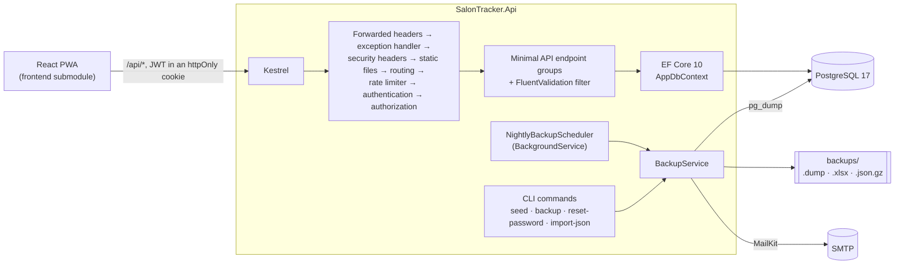

# Architecture

This is the ASP.NET Core backend of Salon Tracker. The product decisions behind it (why a
PWA, why prices are snapshotted, why accounts are soft-deleted, the two publish modes) are
described in the [Node version's architecture notes](https://github.com/AtakanUk/salon-tracker/blob/main/docs/architecture.md);
this page covers how they are implemented in .NET.

## Overview



One process serves the API and the compiled web app. With an argument it runs a server-side
tool instead of the web server, using the same dependency injection container
(`dotnet SalonTracker.Api.dll seed`, `backup`, `reset-password`, ...).

## Project layout

```text
src/SalonTracker.Api/
  Program.cs              entry point: web server or CLI command
  Hosting.cs              composition root: services, middleware order, endpoints
  Configuration/          AppSettings: every environment variable in one place
  Data/                   entities, AppDbContext, EF Core migrations
  Auth/                   JWT cookie, current user, admin policy
  Contracts/              response DTOs - the shapes the web app is built against
  Features/               one static class per endpoint group, requests and validators next to it
  Backup/                 nightly job, scheduler, Excel and JSON export, restore, retention rule
  Infrastructure/         errors, validation filter, time zone helpers, passwords, mailer, headers
  Cli/                    seed and the other server-side tools
tests/SalonTracker.Api.Tests/
  Infrastructure/         WebApplicationFactory fixture, Testcontainers, test clock, HTTP helpers
  Api/                    tests over HTTP against a real PostgreSQL
  Unit/                   time zones, passwords, backup retention
  Fixtures/               a JSON backup written by the Node version
frontend/                 git submodule: the salon-tracker repository, of which only web/ is used
```

## The API contract

The web app is not changed for this backend, so the contract is fixed: paths, query
parameters, JSON field names, which fields are omitted, enum spellings (`ADMIN`,
`COMPLETED`) and error codes (`{ "error": "edit_window_expired" }`). The endpoint list is in
the [Node version's notes](https://github.com/AtakanUk/salon-tracker/blob/main/docs/architecture.md#api);
in development the app also serves an OpenAPI document at `/openapi/v1.json`.

How the contract is kept:

- **Response DTOs** (`Contracts/Dtos.cs`) are records whose property names serialize to the
  expected camelCase. Relations the caller did not load are left out of the JSON rather than
  sent as empty lists, because the web app distinguishes the two.
- **Enums** go over the wire as `ADMIN` / `COMPLETED` through a `JsonStringEnumConverter` with
  the `SnakeCaseUpper` naming policy, and are stored the same way in the database.
- **Errors** are thrown as `ApiException(status, code)` and written by one `IExceptionHandler`.
  FluentValidation failures and malformed bodies (`ThrowOnBadRequest`) become `validation`,
  unexpected exceptions become `internal` and land in the error log shown on the System page.
- **Partial updates** use nullable request properties. The one place where `null` and "not
  sent" mean different things - reopening a record with `"finishedAt": null` - reads the body
  as a `JsonObject`.

## Data

EF Core 10 with Npgsql and the snake_case naming convention: tables `users`, `services`,
`sessions`, `session_items`. Migrations are applied when the app starts.

- **One open customer per employee** is a filtered unique index,
  `HasIndex(s => s.EmployeeId).IsUnique().HasFilter("status = 'ACTIVE'")`. The start endpoint
  checks first and also catches the unique violation, so a double tap racing past the check
  still gets `409 active_session_exists`.
- **Price snapshots**: `SessionEndpoints.PricedLine` is the only place that decides a line's
  price. Listed services are priced from the database; only the custom service takes its
  amount from the request. Corrections keep the snapshot of services already on the record.
- **Soft delete**: `DeletedAt` plus a `name#id` username. `User.DisplayUsername` hides the
  suffix; `#` is not allowed in usernames, so it cannot clash with a live account.
- **Deletes that destroy history** (permanent account delete, retention cleanup) run as
  `ExecuteDeleteAsync` in a transaction.

## Authentication and authorization

- A JWT (HS256, 60 days, so tablets stay signed in) in an httpOnly, SameSite=Lax cookie named
  `token`, Secure in production. `JwtBearerEvents.OnMessageReceived` reads it from the cookie.
- `OnTokenValidated` loads the user and fails the request when the account no longer exists,
  is deactivated or deleted. It also adds the role claim **from the database**, so demoting or
  deactivating an account takes effect on the next request rather than when the token expires.
  The loaded user is tracked by the request's `DbContext`, so endpoints can change it directly.
- The `admin` policy is `RequireRole`; challenges and forbidden responses are written as
  `{ "error": "unauthorized" }` / `{ "error": "forbidden" }`.
- **Rate limiting**: the built-in `RateLimiter` with fixed windows partitioned by client
  address - 20 logins and 10 password changes per minute. `ForwardedHeaders` trusts exactly one
  proxy (`ForwardLimit = 1`): trusting the whole `X-Forwarded-For` chain would let a client
  forge its own address and get a fresh bucket on every attempt. A test sends forged headers
  through the real pipeline to prove it.
- **Security headers** (CSP without script exceptions, HSTS in production, nosniff,
  frame-ancestors) are set by the app, so they apply whether Tailscale or Caddy is in front.

## Time

- Everything that reads the clock takes a `TimeProvider`. The tests replace it with a shifted
  clock, so "31 minutes later" is one line instead of a wait.
- Statistics are cut at the salon's local midnight with `TimeZoneInfo` (`SalonTime`), including
  the days daylight saving time starts and ends.

## Backups

- `BackupService` runs `pg_dump` as a process, builds the Excel workbook with ClosedXML and the
  JSON export, applies the retention rule and mails the files with MailKit. A flag guarded by
  `Interlocked` keeps two runs from overlapping.
- `NightlyBackupScheduler` is a `BackgroundService`: 03:00 salon time, plus a catch-up run after
  start-up when the last backup is older than 25 hours.
- **The JSON format is the Node version's**: the same field names, enum spellings and
  millisecond UTC timestamps. A test restores a backup written by the Node code and signs in
  with a password hashed by `bcryptjs`.
- **Restore** inserts rows with `INSERT ... ON CONFLICT DO NOTHING`, batched with `NpgsqlBatch`
  in one transaction, then moves the identity sequences past the restored ids. Nothing existing
  is changed, so running it twice is harmless.
- `BackupRetention.Expired` (60 days, plus the oldest backup of every month for good) is a pure
  function with its own unit tests.

## Testing

- `WebApplicationFactory<Program>` runs the real app with its real middleware; tests talk to it
  over HTTP like the web app does, with a cookie per test user.
- The database is real PostgreSQL 17: Testcontainers by default, or `TEST_DATABASE_URL` (the
  name must end in `_test`, because every test truncates the tables). The app's own startup
  applies the migrations, so the filtered unique index is exercised as deployed.
- xUnit v3 on Microsoft Testing Platform. CI also builds the Docker image, starts the compose
  stack, seeds it, signs in through the API and takes a backup with the real `pg_dump`.

## Known trade-offs

- The container runs as root, like the Node version: the `backups/` bind mount would need
  matching ownership for a non-root user.
- Changing your own password does not sign out your other devices (no password version in the
  token). Deactivating the account does, because every request re-reads the user.
- Statistics aggregate in memory after one query. That is fine for a salon's volume; a much
  larger dataset would move the grouping into SQL.
